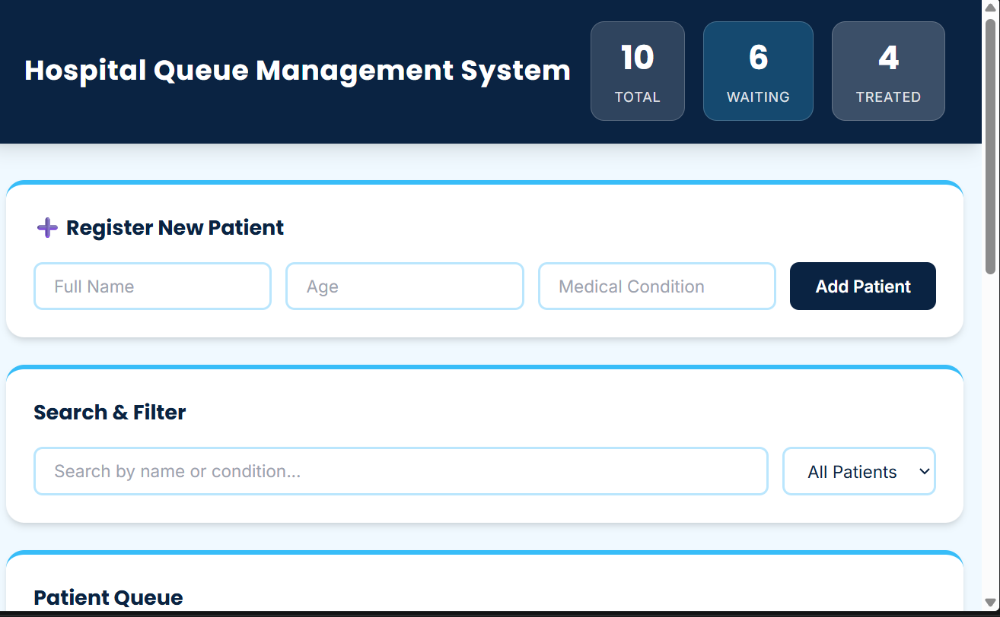
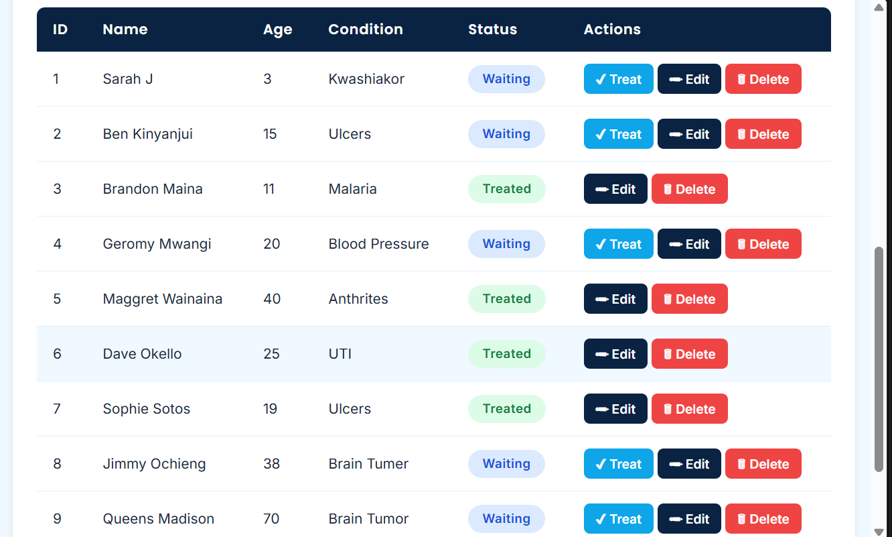
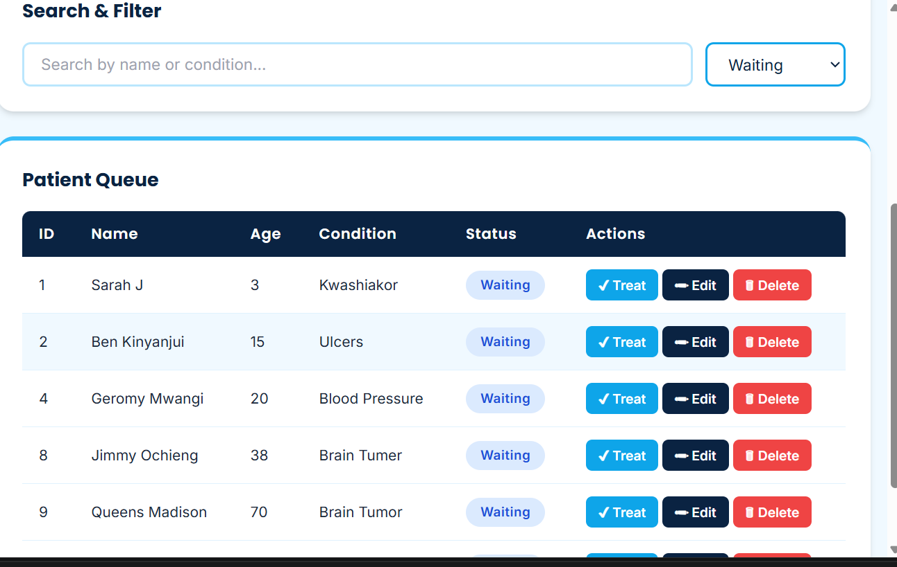
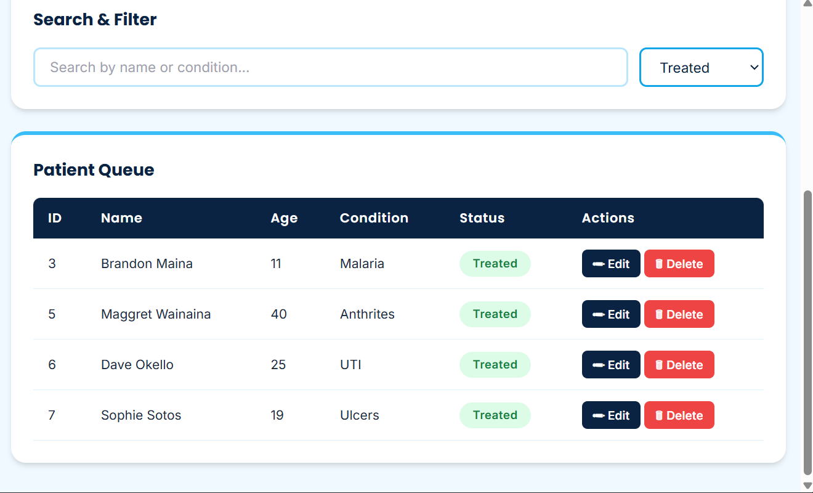
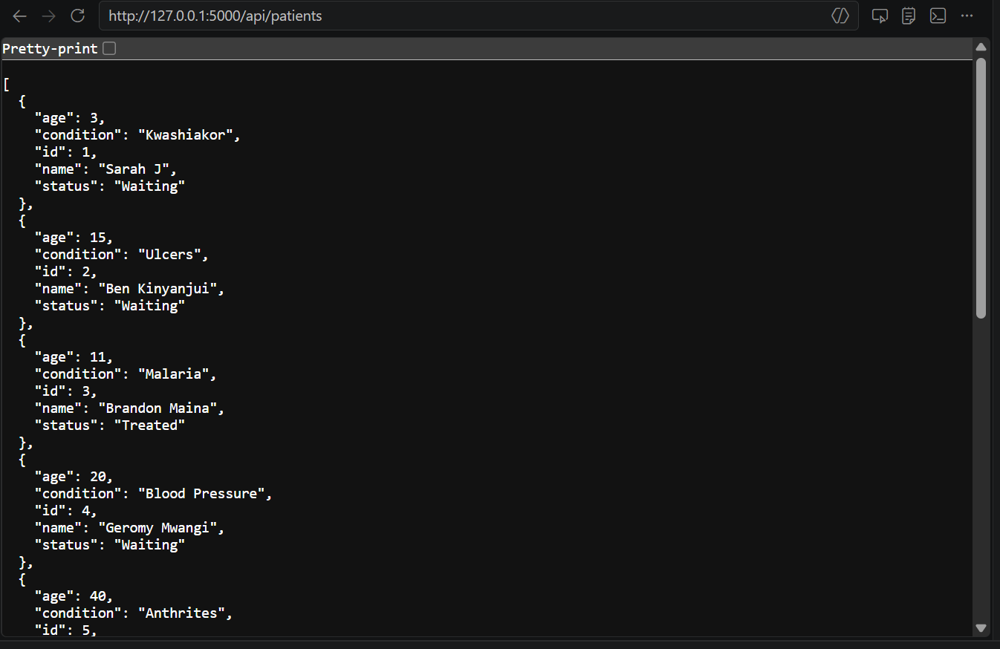
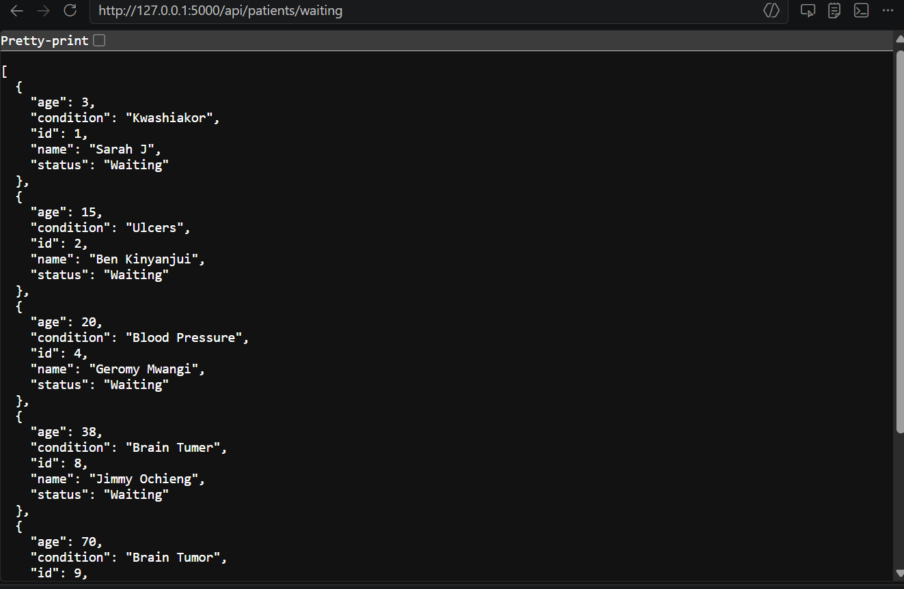
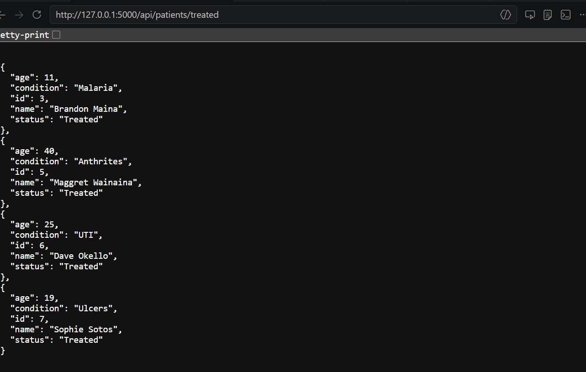

## Hospital Queue Management System

## Project Description
A full-stack Hospital Patient Queue Management System built with Python Flask for the backend REST API and HTML/CSS/JavaScript for the frontend interface. The system allows hospital staff to register patients, track their queue status, update their information, and mark them as treated.

---

## Technologies Used

### Backend
- Python 3.12
- Flask 3.1.3
- Flask-CORS 6.0.2

### Frontend
- HTML5
- CSS3
- JavaScript (Vanilla)
- Tailwind CSS (CDN)
- Google Fonts — Poppins & Inter

---

## How to Run the Project

### 1. Clone the repository
```bash
git clone https://github.com/OjulaRoseline/HOSPITAL-QUEUE-SYSTEM
cd HOSPITAL_Q_SYST
```

### 2. Create and activate virtual environment
```bash
# Windows
python -m venv venv
venv\Scripts\activate
```

### 3. Install dependencies
```bash
pip install flask flask-cors
```

### 4. Run the Flask server
```bash
python app.py
```

### 5. Open in browser
    http://127.0.0.1:5000/
## API Endpoints

| Method | Endpoint | Description |
|--------|----------|-------------|
| GET | /api/patients | Get all patients |
| POST | /api/patients | Register a new patient |
| GET | /api/patients/<id> | Get a single patient |
| PUT | /api/patients/<id> | Update patient details |
| DELETE | /api/patients/<id> | Delete a patient |
| GET | /api/patients/waiting | Get all waiting patients |
| GET | /api/patients/treated | Get all treated patients |
| PUT | /api/patients/<id>/treat | Mark patient as treated |

---

## Frontend Features
-  Register new patients with name, age, and condition
-  View all patients in a clean queue table
-  Edit patient information inline
-  Delete patients from the queue
-  Mark patients as Treated
-  Search patients by name or condition
-  Filter by Waiting or Treated status
-  Live stats showing Total, Waiting, and Treated counts
-  Toast notifications for all actions
-  Fully responsive design

---

## Screenshots

> *,,,,,,*

---

## Author
Roseline Ojula
GoldenTech Computer Training College